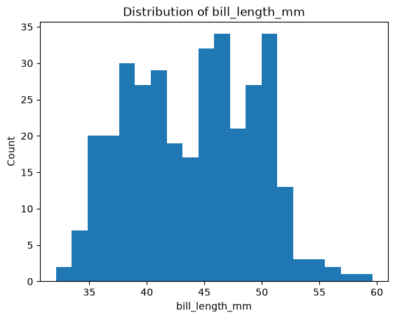

# datafun-02-automation

[](https://denisecase.github.io/pro-analytics-02/workflow-b-apply-example-project/)
[](./pyproject.toml)
[](https://docs.astral.sh/uv/)
[](https://docs.astral.sh/ty/)
[](https://zensical.org/)
[](./LICENSE)

> Professional Python project: automation with loops and branching.

# My Analytics Project

💡 **Note:** This repository was originally cloned from (https://github.com/denisecase/datafun-02-automation). I have updated it to include a custom while loop with conditional statements, an appended dataframe, and a summary of penguin bill length classification required for our week 2 deliverable.

# To Run the Module
uv run python -m datafun.app

# Datafun-02-Automation: Penguin Bill Length Classifier

A Python-based automation project that simulates a live data stream to process and classify penguin measurements from the Palmer Penguins dataset.

## 🚀 Project Overview
This project reads penguin dataset records and streams them one by one. As each record is processed, the application uses dynamic threshold multipliers to evaluate the `bill_length_mm` and automatically classify each penguin's bill size.

- **Short Threshold Multiplier:** 0.9 (Flags bills under ~39.53mm)
- **Long Threshold Multiplier:** 1.1 (Flags bills over ~48.31mm)

## 📋 Features
- **Simulated Data Stream:** Uses a `while` loop combined with `time.sleep` to mimic real-time data ingestion.
- **Dynamic Classification:** Automatically tags records as `SHORT`, `LONG`, or `MEDIUM` based on standard deviations from the dataset mean.
- **Custom Logging:** Utilizes structural logging statements (`LOG.info`) to print real-time tracking metrics to the terminal.

## 🛠️ Prerequisites & Installation
Ensure you have Python 3.x and `pip` installed on your machine.

1. **Clone your personal repository:**
   ```bash
   git clone <your-repository-url>
   cd datafun-02-automation
   ```

2. **Install dependencies:**
   ```bash
   pip install pandas
   ```

## 💻 How to Run
Execute the primary automation script from your terminal:
```bash
python3 main.py
```

## 📊 Sample Output
When running, your terminal log stream will look like this:
```text
Current bill_length_mm: 39.1
Bill length classification: SHORT
Updated count: 1
...
```


## Project Motivation

Explore data while learning some Python basics like branching and repetition.
Analysts often **repeat logic** (e.g. do the same thing for each observation/row
in a dataset) and **branch based on conditions**.
For example, **if** a missing value is detected,
**then** we apply special instructions.

## Use Python to Automate Logic

Python helps automate our analysis.
We will use:

- a `for` loop to repeat work for each item in a list
- a **list comprehension** to transform one list into another
- `if / elif / else` to branch based on conditions
- a `while` loop to repeat work while a condition is true

## Custom Narrative (Extracted from Output)

Selected group column: **species**

Reason for choosing this group:

The species column has a small number of unique values.
There are three unique species, so a for loop can
process and log each one.

Selected measurement column: **bill_length_mm**

Reason for choosing this measurement:

Bill length varies across penguins.
There is no fixed cutoff, so we'll calculate the average
and assign a classification depending on a threshold
around the average value.

```text
Sample bill_length_mm: 39.1
Short threshold multiplier: 0.9
Long threshold multiplier:  1.1
Short threshold: 39.529736842105265
Long threshold:  48.31412280701755
First row bill_length_mm classification: SHORT

Max records to process: 10
Stream wait seconds: 1
```

See [project.log](project.log) for more.

## Initial Results

The project creates a histogram showing the distribution
of the selected numeric measurement.



## Important Folders and Files

- **data/** - the CSV data file
- **docs/** - the project narrative and documentation
- **src/datafun/** - the Python instructions
- **zensical.toml** - update authorship & links

## Common Workflow

Follow the
[step-by-step workflow guide](https://denisecase.github.io/pro-analytics-02/workflow-b-apply-example-project/)
carefully.

Why? Because getting a Python project running your
machine requires many parts working together -
and once it runs, it makes everything else possible.


## Success

After completing Phase 1. **Start & Run**, you'll have the example project,
running on your machine.
A new file `project.log` will appear in the root project folder
and running the example script will print out:

```shell
===================================
END main() - Executed successfully!
===================================
```

## Command Reference

The commands below are used in the workflow guide above.
They are provided here for convenience.

Follow the guide for the **full instructions**.

<details>
<summary>Show command reference</summary>

### In a machine terminal (open in your `Repos` folder)

Open a machine terminal in your `Repos` folder,
change directory (cd) into the new folder,
and run `code .` to open only this example project in VS Code:

```shell
git clone https://github.com/rlorey/datafun-02-automation

cd datafun-02-automation
code .
```

### In a VS Code terminal

These are listed for convenience.
For best results, follow the detailed instructions in
[pro-analytics-02 guide](https://denisecase.github.io/pro-analytics-02/).

Use VS Code menu option `Terminal` / `New Terminal` to open a **VS Code terminal**
in the root project folder.
Copy each command, paste into your terminal, and hit ENTER,
to run each command one at a time.

```shell
uv self update
uv python pin 3.14

uv python install
uv lock --upgrade
uv sync

uv run pre-commit install
uv run pre-commit autoupdate

git add -A
uv run pre-commit run --all-files
# repeat if changes were made by pre-commit tasks
git add -A
uv run pre-commit run --all-files


# do chores
uv run ruff format .
uv run ruff check . --fix
uv run ty check
uv run python -m pytest
uv run python -m zensical build

# save progress as you work
git add -A
git commit -m "your message here"
# repeat if changes were made (try the UP ARROW)
git add -A
git commit -m "your message here"

git push -u origin main
```

</details>

## Helpful Tips

- Use the **UP ARROW** and **DOWN ARROW** in the terminal
  to scroll through past commands.
- Use `CTRL+f` to find (and replace) text within a file.

## Much Can Be Ignored

- You do not need to add to or modify `tests/`.
  Tests are recommended and provided for example only.
- Many files are silent helpers.
  [Explore](https://denisecase.github.io/professional-python-project-explainer/)
  as you like, but most files are never touched.
- You do NOT need to understand everything;
  let understanding build over time.

## As Needed

If VS Code does not automatically use the new `.venv` environment:

1. Open the Command Palette (`Ctrl+Shift+P`).
2. Run **Python: Select Interpreter**.
3. Select the interpreter from this project's `.venv` folder.

If VS Code still does not recognize the environment or newly installed tools:

1. Open the Command Palette (`Ctrl+Shift+P`).
2. Run **Developer: Reload Window**.


## Documentation

- [Documentation](https://denisecase.github.io/datafun-02-automation/)

## Data Card

- [Palmer Penguins Data Card](./docs/data-card.md)

## Annotations

- [.annotations/annotations.md](./.annotations/annotations.md)

## Citation

- [CITATION.cff](./CITATION.cff)

## License

This project is licensed under the [MIT License](./LICENSE).
